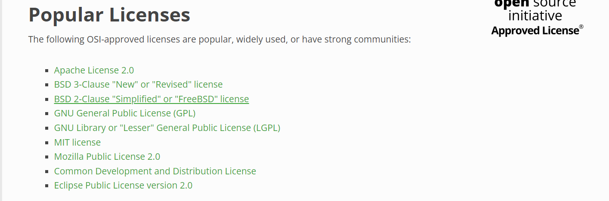
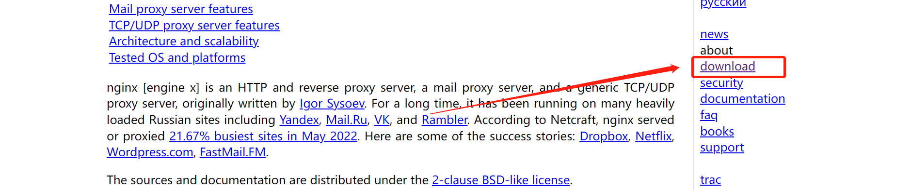
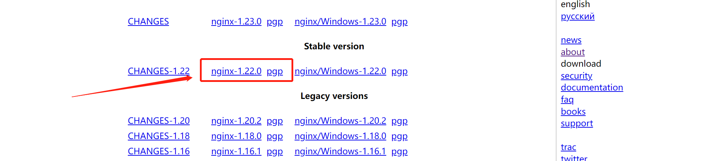
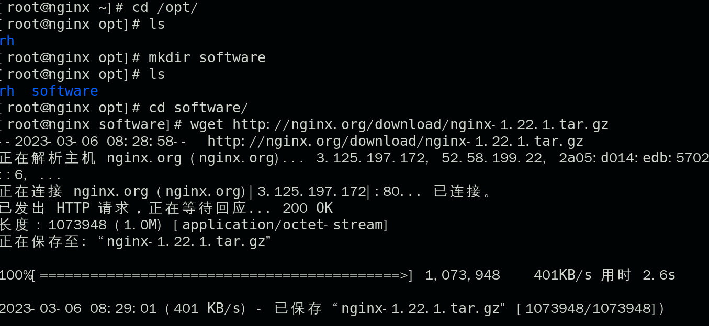
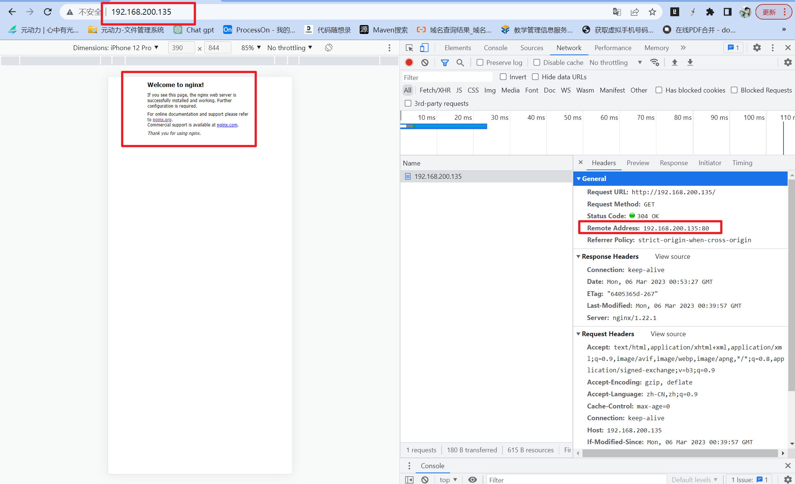
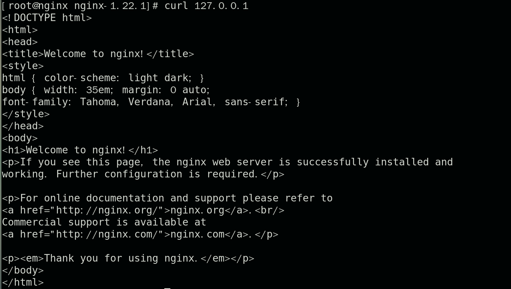
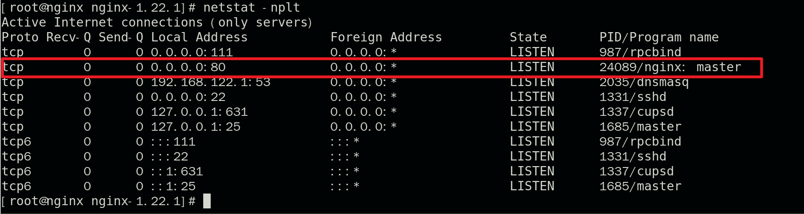

# nginx教程

## 第一章 基础及安装

### 一、nginx 功能介绍

Nginx ("engine x") 是一款开源的，支持高性能、高并发的 **Web 服务和代理服务软件**。它是由俄罗斯人 Igor Sysoev 开发的，最初被应用在俄罗斯的大型网站 www.rambler.ru 上。后来作者将源代码以类 BSD 许可的形式开源出来供全球使用。因为它的`稳定性`、`丰富的模块库`、`灵活的配置`和`低系统资源`的消耗而闻名。

目前，市场上还有很多的同类竞品，如大名鼎鼎的apache，Lighttpd。目前，Nginx的市场份额和域数量双双稳居世界第一，并以 4.12 亿的总数遥遥领先其它竞争对手。


**小知识：**

>BSD许可证的条款

使用BSD协议，需要遵守以下规则

1. 如果再发布的产品中包含源代码，则在源代码中必须带有原来代码中的BSD协议；
2. 如果再发布的只是二进制类库/软件，则需要在类库/软件的文档和版权声明中包含原来代码中的BSD协议；
3. 不可以用开源代码的“作者/机构的名字”或“原来产品的名字”做市场推广。


现今存在的开源协议很多，而经过Open Source Initiative（开放源代码倡议）通过批准的开源协议目前有60多种（http://www.opensource.org/licenses/alphabetical ）。我们在常见的开源协议如BSD, GPL, LGPL,MIT等都是OSI批准的协议。

我们可以在这网网站，



我们摘取几个和大家分享一下：

- Apache License 2.0：它是对商业应用友好的许可。使用者也可以在需要的时候修改代码来满足需要并作为开源或商业产品发布/销售。
- BSD开源协议（Berkerley Software Distribution）：商业软件可以使用，也可以修改使用BSD协议的代码。
- MIT ( MIT license )：商业软件可以使用，也可以修改MIT协议的代码，甚至可以出售MIT协议的代码。
- MPL ( Mozilla Public License 1.1 )：商业软件可以使用，也可以修改MPL协议的代码，但修改后的代码版权归软件的发起者。
- CDDL (Common Development and Distribution License )：商业软件可以使用，也可以修改CDDL协议的代码。
- EPL (Eclipse Public License 1.0 )：商业软件可以使用，也可以修改EPL协议的代码，但要承担代码产生的侵权责任。
- GPL ( GNU General Public License )：商业软件不能使用GPL协议的代码。
- LGPL ( GNU Library or “Lesser” General Public License )：商业软件可以使用，但不能修改LGPL协议的代码。


### 二、nginx可以提供的服务

    1. web 服务
    2. 负载均衡 （反向代理）
    3. web cache（web 缓存）


### 三、nginx 的优点

    1. 比其他服务器响应更快。
     2. 高扩展，nginx的设计极具扩展性，他是由多个功能不同且耦合性极低的模块组成。
     3. 单机支持并发极高，理论上支持10万的并发连接，nginx支持的并发连接和内存相关，超过10万也是可以的。
     4. 低内存消耗，10000个非活跃的http keep-alive链接在nginx中仅仅消耗2.5M的内存。
     5. 支持热部署，如不用停止服务就能重新加载配置文件。
     6. 极具自由的BSD许可协议。我们不仅可以直接阅读nginx的源代码、还能用来修改升级。


### 四、nginx应用场合

    1. 静态服务器。用来存放我们的静态资源，如图片、静态页面、js、css等。
    2. 反向代理，负载均衡。日pv2000W以下，都可以直接用nginx做代理。
    3. 缓存服务。


### 五、nginx实战

我们的nginx测试都是在linux环境中进行的，所有首先你需要一个linux系统，可以是云服务器，也可以是自己的vmware。

#### 1、下载nginx安装包

进入nginx官网（http://nginx.org/en/）：



Nginx官网提供了三个类型的版本

- Mainline version：Mainline 是 Nginx 目前主力在做的版本，可以说是开发版
- Stable version：最新稳定版，生产环境上建议使用的版本
- Legacy versions：遗留的老版本的稳定版

我们下载这个最新的稳定版本：




#### 2、安装依赖包

nginx安装依赖GCC、openssl-devel、pcre-devel和zlib-devel软件库，他们的作用如下：

- zlib库用于对HTTP包的内容做gzip格式的压缩，并指定对于某些类型（content-type）的HTTP响应使用gzip来进行压缩以减少网络传输量，则在编译时就必须把zlib编译进Nginx。
- Pcre全称（Perl Compatible Regular Expressions），Perl库，包括 [perl](https://baike.baidu.com/item/perl/851577) 兼容的[正则表达式](https://baike.baidu.com/item/%E6%AD%A3%E5%88%99%E8%A1%A8%E8%BE%BE%E5%BC%8F)库，如果我们在nginx中使用了正则表达式，那么在编译Nginx时就必须把PCRE库编译进Nginx。
- 如果服务器不只是要支持HTTP，还需要在更安全的SSL协议上传输HTTP，那么需要拥有OpenSSL。另外，如果我们想使用MD5、SHA1等散列函数，那么也需要安装它。可以这样安装：

我们使用一下的命令进行安装：

```bash
yum install gcc zlib-devel  pcre pcre-devel openssl openssl-devel -y 
yum -y install gcc openssl openssl-devel pcre-devel zlib zlib-devel
```


小知识：

devel 包主要是供开发用，至少包括以下2个东西头文件和链接，有的还含有开发文档或演示代码。

以 glib 和 glib-devel 为例:

- 如果你安装基于 glib 开发的程序，只需要安装 glib 包就行了。

- 但是如果你要编译使用了 glib 的源代码，则需要安装 glib-devel。


#### 3、编译安装

下载nginx

```shell
wget http://nginx.org/download/nginx-1.22.0.tar.gz
```




解压：

```shell
tar -zxvf nginx-1.22.1.tar.gz
```

nginx最简单的编译安装方式，就是进入nginx解压后的目录，使用以下命令：

```shell
./configure
make
make install
```

- `./configure`命令做了很多幕后工作，包括检测操作系统内核和已经安装的软件，参数的解析，中间目录的生成，以及根据参数生成c源码文件和makefile文件等。
- make命令根据，configure命令生成的makefile文件编译nginx工程，并生成目标文件、最终的二进制文件。

- make install命令负责将nginx安装到指定的安装目录，包括相关目录的建立和二进制文件、位置文件的复制。

以上命令会将nginx按照默认配置（默认模块、默认安装路径）进行安装，如果需要自定义一些配置，则需要使用如下的方式。

具体的命令如下：

- 使用`./configure --help`查看各个模块的使用情况。
- 使用`--without-http_ssi_module`的方式关闭不需要的模块。
- 可以使用`--with-http_perl_modules`方式安装需要的模块。

>编译命令

```bash
tar -zxvf nginx-1.22.1.tar.gz
cd nginx-1.22.1

mkdir /data/nginx -p

# -M ： 不创建主目录  -s ： 不允许登录 /sbin/nologin是一个有一个特殊的shell，不需要登陆
useradd nginx -M -s /sbin/nologin 

./configure --prefix=/data/nginx --user=nginx --group=nginx  --with-http_ssl_module  --with-http_stub_status_module

make && make install 
```

```nginx
--with-http_ssl_module  安装该模块，该模块是nginx支持ssl协议，提供https服务。
--with-http_stub_status_module  #是一个监视模块，可以查看目前的连接数等一些信息，因为是非核心模块，所以我们使用nginx -V默认是没有安装的
```


> 测试nginx配置文件是否正常

```bash
/data/nginx/sbin/nginx -t 
nginx: the configuration file /data/nginx-1.10.1/conf/nginx.conf syntax is ok
nginx: configuration file /data/nginx-1.10.1/conf/nginx.conf test is successful
```


> 启动nginx服务器

```bash
/data/nginx/sbin/nginx  -t      ## 检查配置文件
/data/nginx/sbin/nginx          ## 确定nginx服务

cd sbin						  ## 进入/data/nginx/sbin文件夹
./nginx						  ## 启动服务
netstat -lntup |grep nginx      ## 检查进程是否正常
curl http://localhost           ## 确认结果
```

- Windows端测试：

  ```bash
  #关闭防火墙
  systemctl stop firewalld.service
  
  #windows浏览器输入 Linux的ip地址+80端口：如下
  192.168.200.135:80
  ```

  

  

- Linux端测试：

  ```bash
  curl 127.0.0.1
  ```

  


>nginx其他命令

```bash
nginx -s signal
signal：
stop — 立马关闭
quit — 优雅关闭，处理完没处理好的请求后关闭
reload — 重新加载配置文件
reopen — reopening the log files
用来打开日志文件，这样nginx会把新日志信息写入这个新的文件中
```


安装net-tools来查看端口使用情况：

```
yum -y install net-tools
```

net-tools工具箱包括[arp](https://so.csdn.net/so/search?q=arp&spm=1001.2101.3001.7020), hostname, ifconfig, netstat, rarp, route, plipconfig, slattach, mii-tool and iptunnel and ipmaddr等命令。

```shell
netstat -nplt
```




